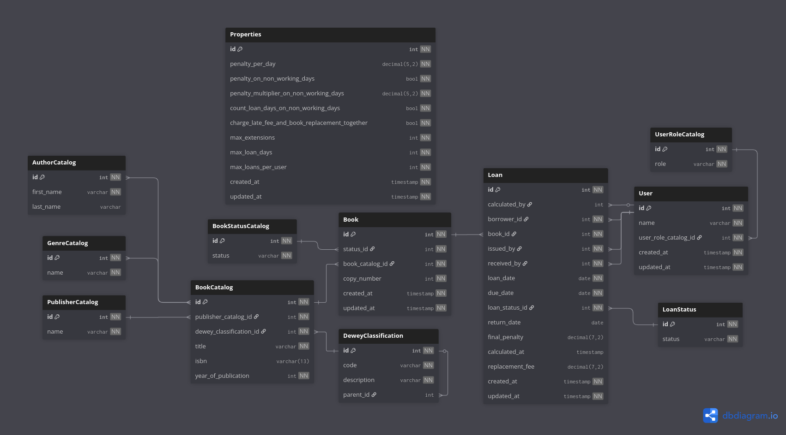

# Silence 📚

**Library Management System**

---

## Overview
Silence is a Library Management System designed to simplify the management of books, authors, publishers, and library loans.  
The project is based on a relational database modeled using [dbdiagram.io](https://dbdiagram.io).

---

## Database
The database structure was carefully designed to handle authors, publishers, genres, classifications, books, users, and loans efficiently.

- **Database Diagram:**  
  

- **Code Reference:**  
  [View Database Code](./doc/database.dbml)

---

## Features ✅

### Authors
- [ ] Add a new author
- [ ] Update author information
- [ ] Delete author
- [ ] List all authors
- [ ] Search author by first name / last name

### Publishers
- [ ] Add a new publisher
- [ ] Update publisher information
- [ ] Delete publisher
- [ ] List all publishers
- [ ] Search publisher by name

### Genres
- [ ] Add a new genre
- [ ] Update genre
- [ ] Delete genre
- [ ] List all genres

### Dewey Classification
- [ ] Add new classification
- [ ] Update classification
- [ ] Delete classification
- [ ] List all classifications
- [ ] Assign parent classification
- [ ] Search classification by code or description

### Book Catalog
- [ ] Add a new book
- [ ] Update book information (title, ISBN, year, publisher, classification)
- [ ] Delete book from catalog
- [ ] List all books
- [ ] Assign authors to a book
- [ ] Assign genres to a book
- [ ] Search books by title, author, genre, or ISBN

### Book Copies (Inventory)
- [ ] Add new book copy
- [ ] Update book copy status
- [ ] Delete book copy
- [ ] List all copies of a book
- [ ] Track unique copy numbers per book

### Book Status
- [ ] Define and manage book statuses (Available, Loaned, Reserved, Lost, etc.)

### Users
- [ ] Add new user
- [ ] Update user information
- [ ] Delete user
- [ ] List all users
- [ ] Assign roles to users
- [ ] Search users by name or role

### Roles
- [ ] Add new role
- [ ] Update role
- [ ] Delete role
- [ ] List all roles

### Loans
- [ ] Loan a book to a user
- [ ] Return a book
- [ ] Track overdue books
- [ ] Track lost books
- [ ] Calculate penalties and fees
- [ ] Assign loaner and receiver
- [ ] Set due date and track return date
- [ ] Manage loan status (Loaned, Returned, Overdue, Lost)
- [ ] List all loans
- [ ] Search loans by user, book, or status

### Library Properties
- [ ] Set penalty per day
- [ ] Configure penalties on non-working days
- [ ] Configure penalty multiplier on non-working days
- [ ] Enable/disable counting loan days in non-working days
- [ ] Enable/disable charging late fees and replacement fees together
- [ ] Set max extensions
- [ ] Set max loan days
- [ ] Set max loans per user
- [ ] Update properties

### Reports (Optional)
- [ ] Generate report of overdue books
- [ ] Generate report of active loans
- [ ] Generate report of most borrowed books
- [ ] Generate report of fines collected
